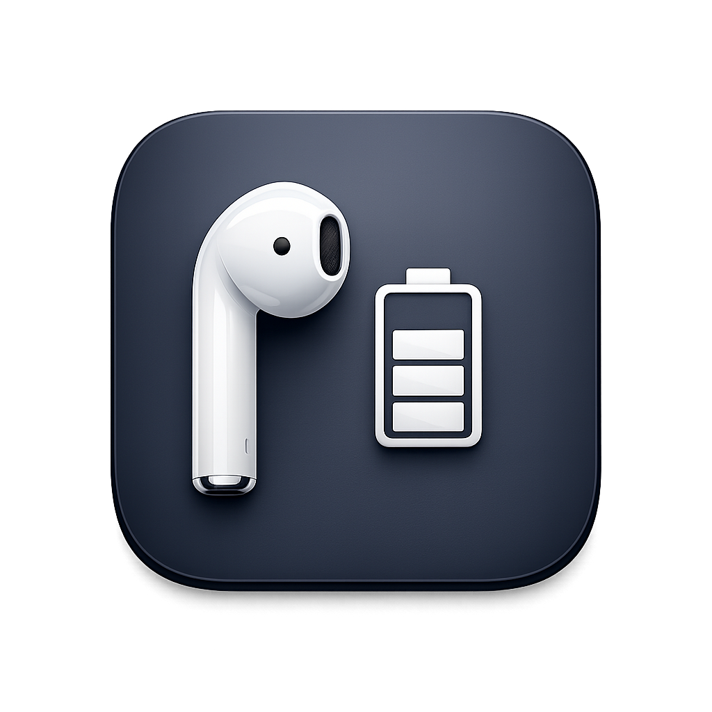

# PodWatch



PodWatch is a native macOS menu bar app for people who rotate AirPods one at a time to stretch listening time. It watches left and right bud battery levels independently, then shows a centered reminder when one side drops below your chosen threshold and again when that bud is charged enough to swap back in.

## Why It Exists

AirPods make it easy to keep listening with one bud while the other charges, but macOS does not give you a purpose-built flow for that habit. PodWatch keeps that loop simple and visible without adding another full app window to your desktop.

## Features

- Native SwiftUI + AppKit macOS menu bar app
- Per-bud monitoring for left and right AirPods battery levels
- Configurable low threshold, charged threshold, overlay duration, and poll interval
- Friendly centered overlay reminders with left/right/both visual cues
- Device picker with persisted settings across launches
- Local-only behavior with no account, backend, or cloud sync

## Install

If you are using the public GitHub repo and do not want to build locally, download the latest app bundle from the repository's **Releases** section.

## Build

Requirements:

- macOS 14 or later
- Xcode 26 or newer

Open [PodWatch.xcodeproj](PodWatch.xcodeproj) in Xcode and run the `PodWatch` scheme, or build from Terminal:

```bash
./build.sh
```

The built app is created at:

```text
build/DerivedData/Build/Products/Release/PodWatch.app
```

## Privacy

PodWatch works entirely on-device.

- Bluetooth device information is read locally from macOS system APIs and `system_profiler`
- Settings are stored in local user defaults
- No analytics, cloud sync, or remote API is required to use the app
